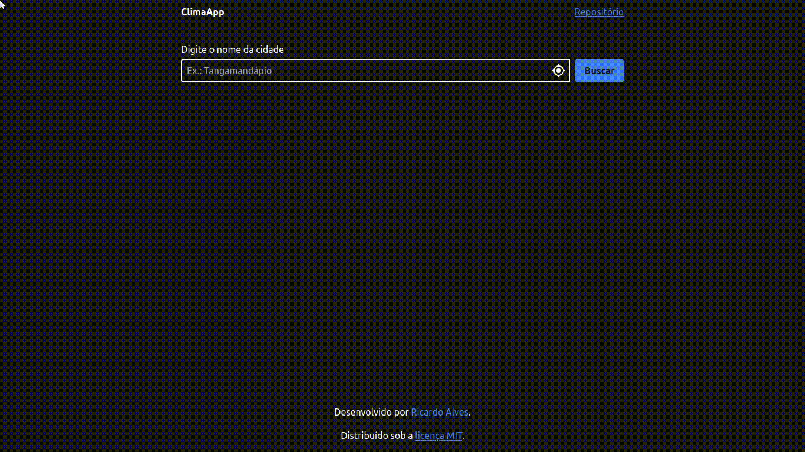

# ClimaApp

[**Acessar a aplicação web**](https://react-weather-hk7qwnmhm-ricardospalves.vercel.app)

Aplicação em _React.js_, _TypeScript_ e _Tailwind CSS_ para exibir o clima atual da cidade buscada.

## License

The code is available under the [MIT license](https://github.com/ricardospalves/react-weather/blob/main/LICENSE).
